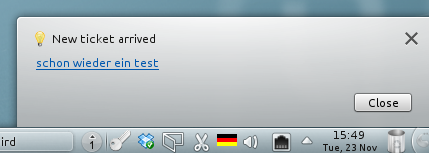

ktroublenotify
==============

KDE OTRS 2.x Notifier

This notofier showed a little notification in KDEs taskbar. Worked with OTRS 2.x. Won't work with OTRS 3.x as this version has a pretty JSON interface.
This code worked when OTRS was configured to work with CAS. There were cookie difficulties that had to be dealt with. Don't ask me how, don't ask me why, this code is from 2010, so I don't remember anything ;)

